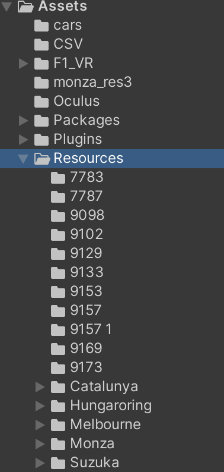
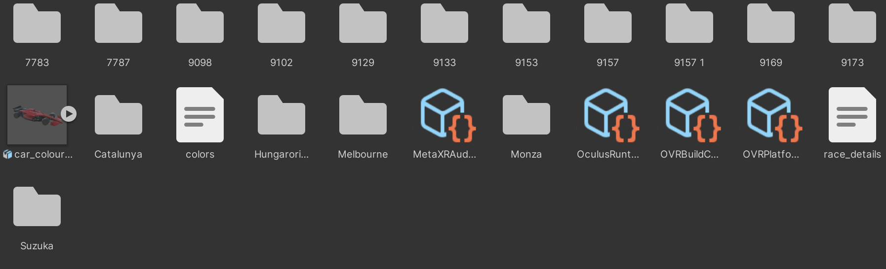
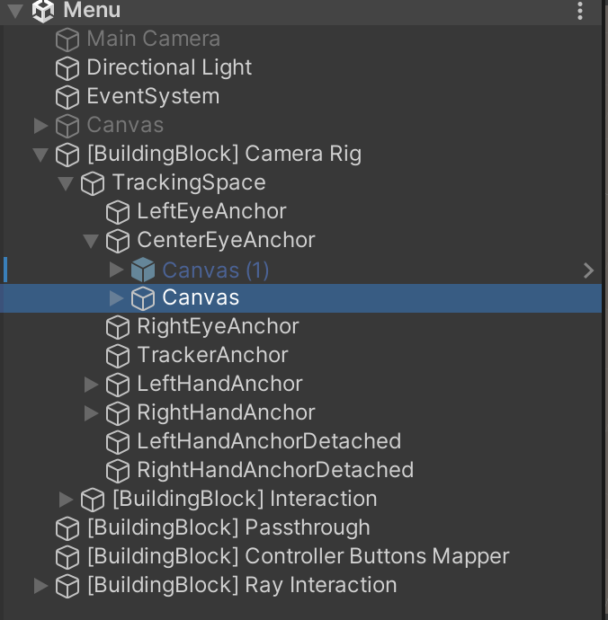
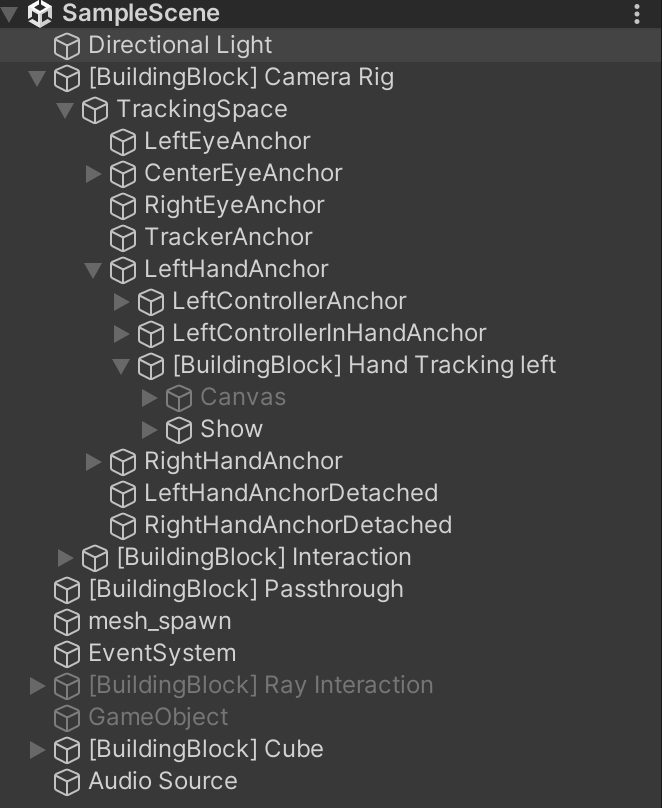
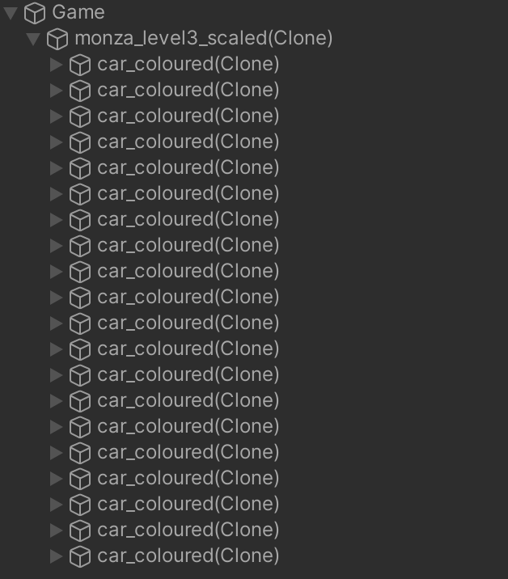
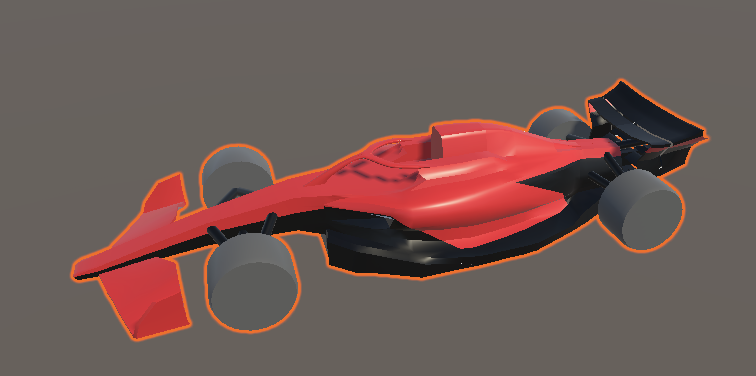
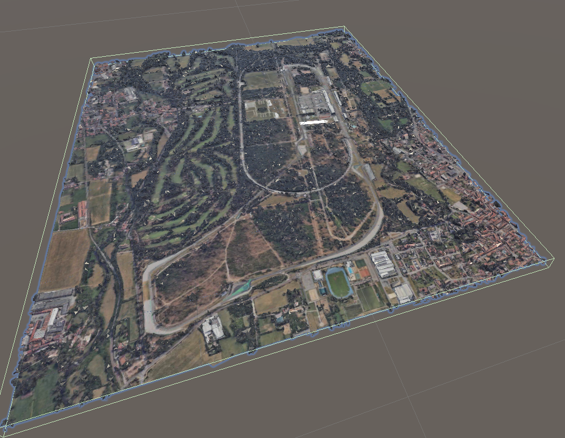

# F1 VR
This project enables a user to rewatch F1 races in mixed reality, displaying a three dimensional map with cars following the actual racing lines of the different drivers.

## Hardware requirements
MetaQuest 3
## Pre prosessing
Before being able to show a race we need to fetch the race data from openF1 using the fetch_session.py file and then use the process_traj.py file to processe the data so delete unused data and interpolate missing sensor data.
## Unity project
In the resources folder all race date, race tracks and racecar 3D model can be found. Race data is saved in folders named after the session name.
The race_details.json file saves all the relations between maps race data and transformations so that the cars are correctly alligned on the map when racing.

  
  

There are 2 scenes for this project a Menu scene and a SampleScene. The menu scene shows the main menu and allows the user to select which race he desires to watch.
The menu (canvas) is attached to the headset center camera so that it is easily accessible. The menu relies on the MainMenu script found in the assets folder.

  

The Sample scene is responsible for spawing the map and cars. This is all done at runtime and uses the user selected session to spawn the correct race. 

  

The Show element allows the user to toggle the in game menu (Canvas). The mesh_spawn element is responsible for spawning the map. The Audio Source play the F1 theme music once the race starts. The mesh_spawn uses the MeshLoader script found in the assets folder and adds all required elements to the mesh so that it is interactable and adds all elements correctly to the scene view.

  

Here monza_level_3_scaled(Clone) is the map mesh with all interaction elements and colliders ect. The car_coloured(Clone) are all the cares from the race which get added using the SmoothTrackingOffline script found in the F1_VR/Scripts/movement folder. This script assigns the correct color to the car and is responsible for making the car move on the map using the driver session data.

## Model
The car was modeled in Blender and the maps were downloaded using [Blosm for Blender](https://github.com/vvoovv/blosm) and cut to size using Blender.

  
  

## Video

  <iframe width="560" height="315" src="https://www.youtube.com/embed/i1ElsVpPGZ0" frameborder="0" allow="accelerometer; autoplay; clipboard-write; encrypted-media; gyroscope; picture-in-picture" allowfullscreen></iframe>

